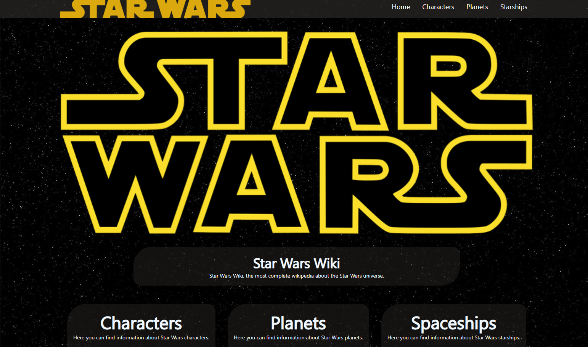
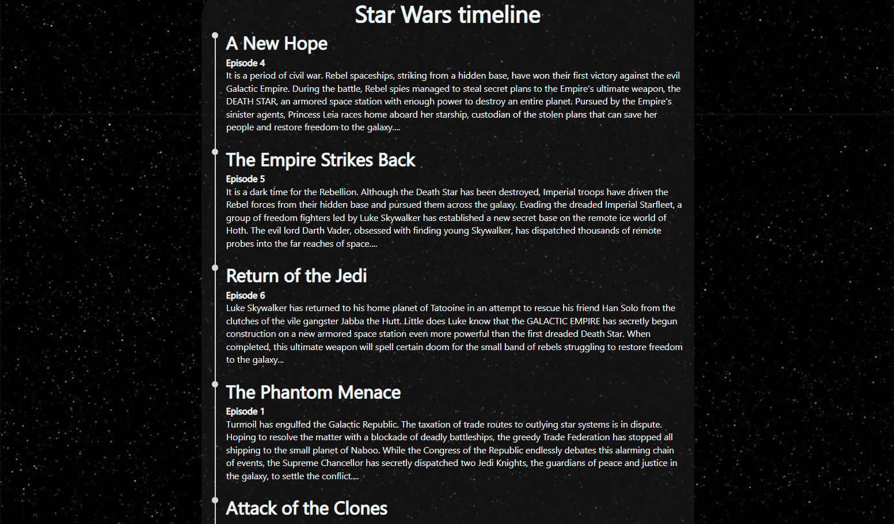
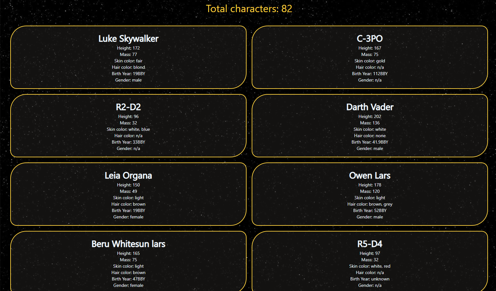

# Star Wars Wiki - ReactJS

## :link:	Live Demo 

[Demo Link](https://starwars-wiki-six.vercel.app/)
## 📷 Screenshot

### Home page
  
  
### Movies Timeline
  
  
### Characters page
  

## 📝 Project Description

The StarWars Wiki project allows users to view the information about each character, planet and spaceship appeared in the Star Wars universe.  

## 📚 Technologies

- ReactJS
- React Hooks
- React Router
- CSS


## :compass: Roadmap

- [x] Add Home page
- [x] Fetch movies 
- [x] Add Category pages
    - [x] Characters
    - [x] Planets
    - [x] Spaceships

## :runner: Run Locally 

Clone the project

```bash
  git clone https://github.com/trstefan/starwars-wiki.git
```

Go to the project directory

```bash
  cd starwars-wiki
```

Install dependencies

```bash
  npm install
```

Start the server

```bash
  npm run start
```


## :star:	Acknowledgements
 - [SWAPI](https://swapi.dev/)
 - [Axios](https://www.npmjs.com/package/axios)
